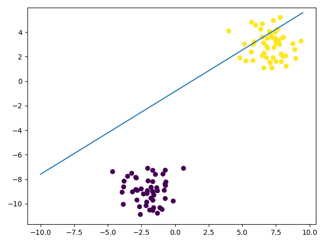
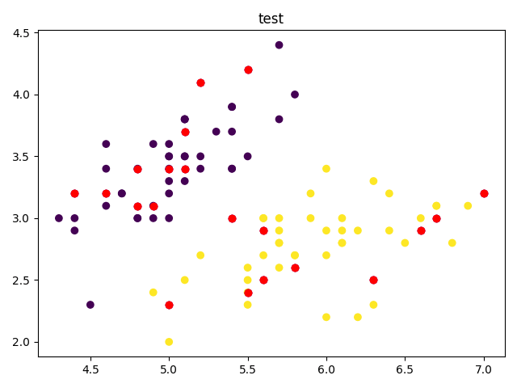
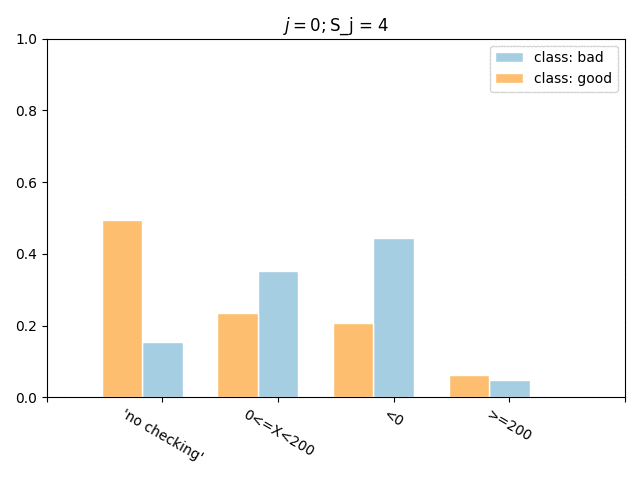
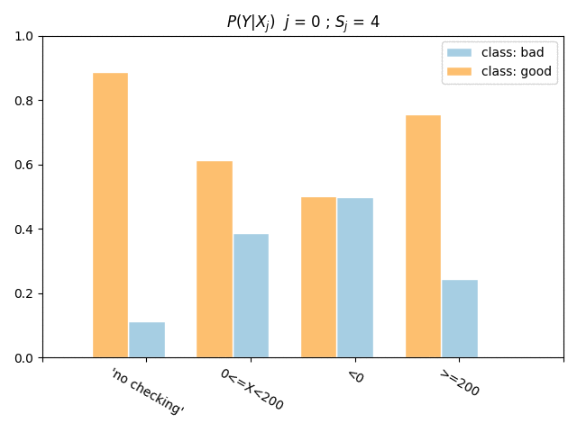
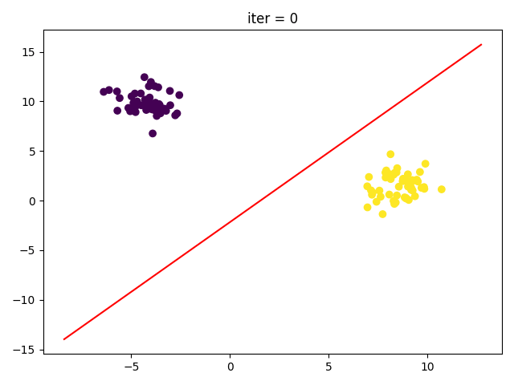

# 统计学习方法(第二版)

---
| Link                                                                  | Illustration              |
| --------------------------------------------------------------------- | ------------------------- |
| [感知机](https://zhen8838.github.io/2020/05/19/statis-learn-cp1/)     |    |
| [K近邻](https://zhen8838.github.io/2020/05/24/statis-learn-cp2/)      |           |
| [朴素贝叶斯](https://zhen8838.github.io/2020/05/24/statis-learn-cp3/) |    |
| [决策树](https://zhen8838.github.io/2020/05/27/statis-learn-cp4/)     |  |
| [逻辑回归](https://zhen8838.github.io/2020/05/30/statis-learn-cp5/)     |  |