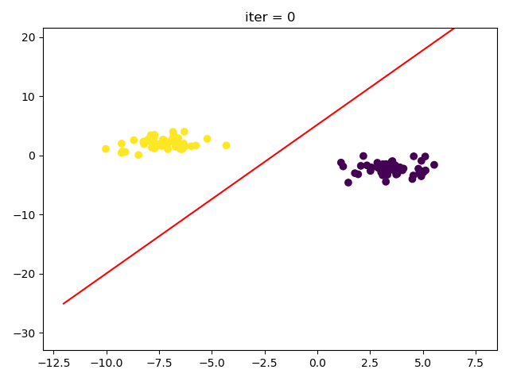
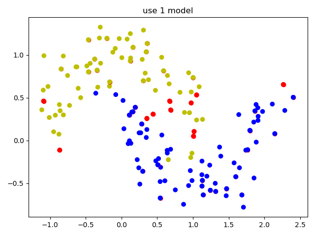
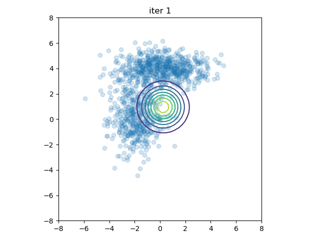
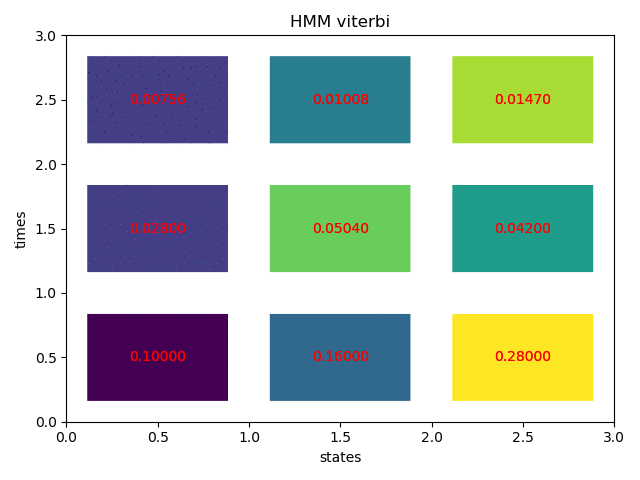
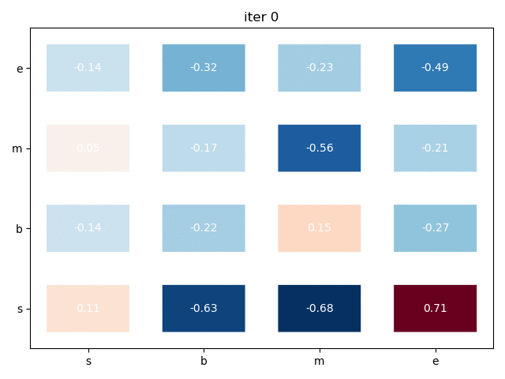
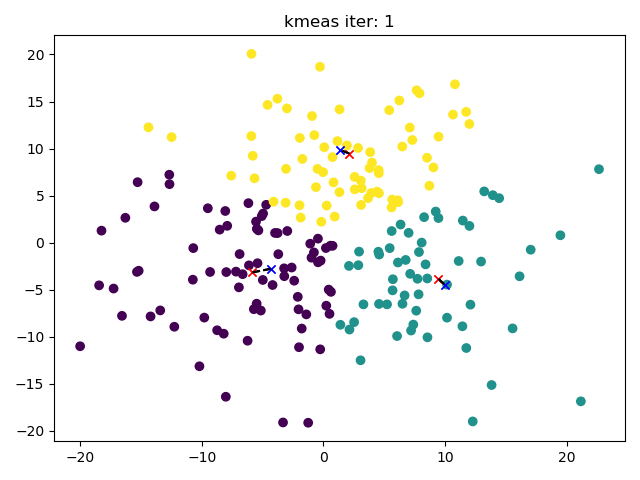
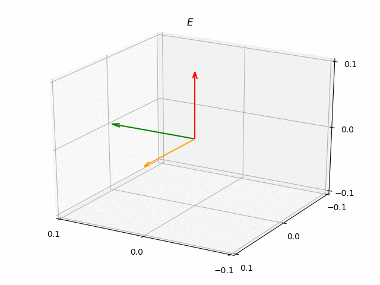
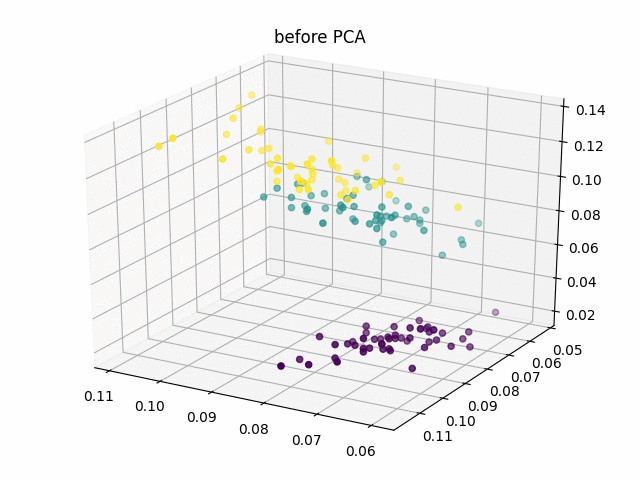
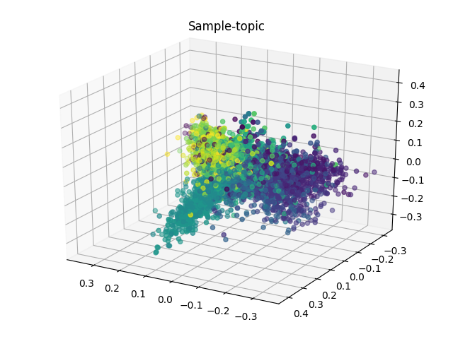
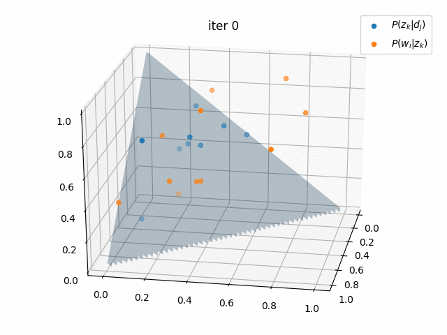

# 统计学习方法(第二版)

    requirements.txt ∋ python=3.7.4

---
| Link                                                                   | Illustration                         |
| ---------------------------------------------------------------------- | ------------------------------------ |
| [感知机](https://zhen8838.github.io/2020/05/19/statis-learn-cp1/)      |               |
| [K近邻](https://zhen8838.github.io/2020/05/24/statis-learn-cp2/)       |                      |
| [朴素贝叶斯](https://zhen8838.github.io/2020/05/24/statis-learn-cp3/)  |               |
| [决策树](https://zhen8838.github.io/2020/05/27/statis-learn-cp4/)      |             |
| [逻辑回归](https://zhen8838.github.io/2020/05/30/statis-learn-cp5/)    |        |
| [支持向量机](https://zhen8838.github.io/2020/06/01/statis-learn-cp6/)  |                      |
| [提升方法](https://zhen8838.github.io/2020/06/06/statis-learn-cp7/)    |                 |
| [EM算法](https://zhen8838.github.io/2020/06/07/statis-learn-cp8/)      |  |
| [隐马尔可夫](https://zhen8838.github.io/2020/06/10/statis-learn-cp9/)  |              |
| [条件随机场](https://zhen8838.github.io/2020/06/13/statis-learn-cp10/) |                      |
| [聚类方法](https://zhen8838.github.io/2020/06/16/statis-learn-cp11/)   |                   |
| 奇异值分解                                                             |                      |
| PCA                                                                    |                      |
| LSA                                                                    |                      |
| [PLSA](https://zhen8838.github.io/2020/07/21/statis-learn-cp15/)       |                     |
| [MCMC](https://zhen8838.github.io/2020/07/28/statis-learn-cp16/)       |                     |
| [LDA](https://zhen8838.github.io/2020/08/04/statis-learn-cp17/)       |                     |